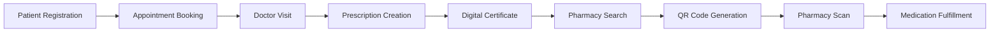

# PIYA Backend API

**A Full Digital Healthcare Coordination Platform** - Connecting Patients,
 Doctors, Ho### Medication Database (Service Implemented [x])

- [x] **Medication Entity Model**
- [x] **Azerbaijan Pharmaceutical Registry Integration** (OpenData.az API -
  sync service ready)
- [x] **Medication Search & Autocomplete**
- [x] **Active Ingredient Tracking**
- [x] **ATC Code Classification**
- [x] **Prescription-Required Flag**
- [x] **Medication Alternatives/Generics**
- [x] **Medication Master Data Management**nd Pharmacies

Built with ASP.NET Core 9.0 and PostgreSQL | Healthcare Ecosystem |
HIPAA-Compliant Ready

## Progress: 

---

## Project Vision

PIYA is evolving from a **Pharmacy Location API** into a **comprehensive
  healthcare coordination platform** that digitizes the entire patient journey:

```text
Patient → Doctor Appointment → Prescription → Pharmacy Fulfillment → Digital Verification
```

### Core Capabilities

- **Real-time appointment booking** with conflict prevention
- **Digital prescription management** with pharmacy inventory matching
- **Hospital & doctor coordination** with availability synchronization
- **QR-based secure medication pickup** with time-limited validation
- **Digital medical certificates** for schools and workplaces
- **Smart pharmacy search** based on medication availability
- **Enterprise-grade security** with audit logging and role-based access

---

## System Architecture

### Healthcare Flow



### Security Model

- **Multi-role system:** Patient, Doctor, Pharmacist, SchoolAdmin, SystemAdmin
- **JWT + Refresh Token** authentication (15-30 min access, 7-day refresh)
- **BCrypt password hashing** (work factor 11)
- **Time-limited QR tokens** (5-minute validity)
- **Audit logging** for all healthcare transactions
- **GDPR-compliant** data handling

---

## Features to Implement

### Authentication & Security

- [x] **Fix JWT Token Generation**
- [x] **Implement Password Hashing**
- [x] **Add JWT Authentication Middleware**
- [x] **Implement Token Validation**
- [x] **Fix Token Expiration Access**
- [x] **Add Refresh Token Logic**
- [x] **Role-Based Authorization (Patient/Doctor/Pharmacist/Admin)**
- [x] **Multi-Factor Authentication**
- [x] **Audit Logging System**
- [x] **QR Token Generation & Validation**

### Appointment System (Service Implemented)

- [x] **Appointment Booking API**
- [x] **Doctor Availability Management**
- [x] **Real-time Conflict Detection**
- [x] **Appointment Status Tracking (Scheduled/Completed/Cancelled/NoShow)**
- [x] **Calendar Integration** (iCal/ICS export, Google Calendar & Outlook URL generation)
- [x] **Booking Confirmation Notifications**
- [x] **Appointment History**
- [x] **Multi-hospital Support**

### Prescription Management (Service Implemented)

- [x] **Digital Prescription Creation**
- [x] **Prescription-Patient-Doctor Linking**
- [x] **Prescription Status Management (Active/Used/Expired/Cancelled)**
- [x] **Multi-medication Support**
- [x] **Dosage & Instructions Tracking**
- [x] **Prescription Expiration Logic**
- [x] **Prescription Verification Endpoint**
- [x] **Prescription History**

### Hospital & Doctor Management (Service Implemented [x])

- [x] **Hospital Entity & CRUD** (HospitalService with 10 methods: GetAll,
  GetById, GetByCity, GetByDepartment, GetActive, Create, Update, Delete,
  Deactivate, Activate)
- [x] **Doctor Profile Management** (DoctorProfileService with 14 methods:
  Create, GetByUserId, GetById, Update, Delete, SearchBySpecialization,
  GetByHospital, GetAvailable, UpdateAvailability, SetOnline, SetOffline,
  GetWorkingHours, UpdateWorkingHours, IsAvailableAt)
- [x] **Doctor Specialization Tracking** (DoctorProfile entity with
  MedicalSpecialization enum: 19 categories including Cardiology, Neurology,
  Pediatrics, etc.)
- [x] **Working Hours Configuration** (WorkingHoursSlot with JSON storage,
  day-based time slots, validation)
- [x] **Doctor-Hospital Association** (DoctorProfile.HospitalIds many-to-many relationship)
- [x] **Doctor Availability Sync (Online/Offline)** (DoctorAvailabilityStatus
  enum: Online, Offline, Busy, OnBreak, OnCall with real-time updates)
- [x] **Doctor Dashboard** (DoctorDashboardController with 20 REST endpoints:
  profile management, availability control, appointment handling, prescription
  creation, patient management, and dashboard statistics)

### Medication Database (Service Implemented)

- [x] **Medication Entity Model**
- [x] **Azerbaijan Pharmaceutical Registry Integration**
- [x] **Medication Search & Autocomplete**
- [x] **Active Ingredient Tracking**
- [x] **ATC Code Classification**
- [x] **Prescription-Required Flag**
- [x] **Medication Alternatives/Generics**
- [x] **Medication Master Data Management**

### Pharmacy Inventory System ([x] COMPLETE)

- [x] **PharmacyInventory Model** - Enhanced with ReorderQuantity,
  LowStockAlertTriggered, LastLowStockAlertAt + 2 new entities (InventoryBatch,
  InventoryHistory)
- [x] **Real-time Stock Tracking** - FIFO batch deduction with user attribution
  and prescription linking
- [x] **Low Stock Alerts** - Automatic alert triggering with auto-reset on
  restock, logged to AuditService
- [x] **Inventory Update API** - 18 REST endpoints via PharmacyInventoryController
  (update, restock, decrease, batch management, history, alerts)
- [x] **Stock History** - Complete audit trail with 7 transaction types
  (Restock, Sale, Adjustment, Return, Expired, Damaged, Transfer)
- [x] **Expiration Date Tracking** - Per-batch expiration dates with automatic
  cleanup and expiring items alerts
- [x] **Batch Number Management** - Full lot/batch tracking with supplier info,
  cost per unit, manufacturing/expiration dates, storage location

### Smart Pharmacy Search (Service Implemented [x])

- [x] **SearchService.SearchByCountry()**
- [x] **SearchService.SearchByCity()**
- [x] **SearchService.SearchByRadius()**
- [x] **Search by Medication Availability (Multi-med Match)**
  (SearchByMedicationAsync, SearchByMultipleMedicationsAsync)
- [x] **Filter Pharmacies with Full Prescription Stock** (SearchPharmaciesWithFullPrescriptionStockAsync)
- [x] **Sort by Distance + Stock Availability**
  (SearchAndSortByDistanceAndStockAsync with composite scoring: 60% stock +
  40% distance)
- [x] **Real-time Inventory Integration** (Direct PharmacyInventory queries with
  stock validation)

### QR Code System ([x] COMPLETE - HIGH SECURITY)

- [x] **Generate Time-Limited QR Tokens (5-min validity)**
  (GeneratePrescriptionQrTokenAsync + API endpoint)
- [x] **HMAC-Signed QR Payload** (HMAC-SHA256 signature with secret key)
- [x] **QR Validation Endpoint** (ValidateQrTokenAsync + 6 REST endpoints in QRValidationController)
- [x] **Prescription Retrieval via QR** (ValidateAndUsePrescriptionQrTokenAsync+
  /scan endpoint)
- [x] **QR Expiration & Revocation** (Database-backed revocation + /revoke endpoint)
- [x] **Pharmacist Scan Interface** (6 controller endpoints: generate, scan,
  validate, revoke, status, history)
- [x] **Anti-Replay Attack Prevention** (One-time use enforcement via IsUsed
  flag + token hash storage)
- [x] **QR Audit Trail** (Complete audit logging with QRToken entity +
  /history endpoint)

**Implementation Details:**

- QRToken entity with 20+ security fields (SHA-256 hashing, HMAC signing)
- QRService with 11 methods (generate, validate, revoke, audit trail)
- QRValidationController with 6 RESTful endpoints
- Security features: Time-limited tokens (5 min), one-time use, IP/device tracking

### Digital Medical Certificates ([x] COMPLETE)

- [x] **DoctorNote Model (Patient/Doctor/Appointment)**
- [x] **Public Verification Token Generation (32+ bytes, hashed)**
- [x] **QR Code for Public Verification**
- [x] **Note Status Management (Active/Revoked/Expired)**
- [x] **POST /api/doctor-notes (Doctor only)**
- [x] **GET /api/doctor-notes/{id} (Doctor/Patient)**
- [x] **POST /api/doctor-notes/{id}/revoke (Doctor only)**
- [x] **GET /api/doctor-notes/verify/{token} (Anonymous)**
- [x] **DoctorNotePublicDto (Minimal exposure)**
- [x] **ValidFrom/ValidTo Period Enforcement**
- [x] **Privacy-Controlled Visibility (Summary optional)**
- [x] **Tamper-Proof Token (SHA-256 Hash-based)**
- [ ] **Certificate PDF Export (Optional)**

**Implementation Details:**

- DoctorNote entity with 20+ fields (token hashing, privacy controls)
- DoctorNoteService with 8 methods (create, verify, revoke, audit)
- DoctorNoteController with 7 RESTful endpoints
- Security features: SHA-256 hashed tokens, revocation support,
  privacy-controlled data exposure

**Design Principles:**

- **No External Integration:** No school/workplace dashboards - public
  verification only
- **QR-Based Sharing:** Patient shares QR code, anyone can verify without account
- **Minimal Public Data:** Only essential info exposed (patient name
  optional/initials, doctor name, dates)
- **Tamper-Proof:** 32+ byte random token, hashed in DB, validated on verify
- **Revocable & Time-Limited:** Doctor can revoke, automatic expiration via ValidTo
- **Privacy First:** Diagnosis details private by default, VisibilityLevel flag
  for controlled exposure

**Public Verification Response (DoctorNotePublicDto):**

- Patient full name or initials (privacy-controlled)
- Doctor full name + license ID
- Clinic/hospital name (optional)
- Note reason category (e.g., "Medical Excuse") or "medical excuse" only
- ValidFrom / ValidTo dates
- IssuedAt timestamp
- Unique note number
- Status indicator (Active/Revoked/Expired)

### Configuration

- [x] **Create appsettings.json Template**
- [x] **Add Connection String Documentation**
- [x] **Environment-Specific Settings**
- [x] **External API Configuration (Medication DB)** (ExternalApisOptions with
  Azerbaijan Pharmaceutical Registry, Google Maps, Email/SMS services)
- [x] **QR Token Signing Key Management** (SecurityOptions with validation,
  strongly-typed configuration, startup validation)

---

### High Priority

### User Management

- [x] **UserService.Authenticate()**
- [x] **UserService.Create()**
- [x] **UserService.GetById()**
- [x] **UserService.Update()**
- [x] **UserService.Delete()**
- [x] **Create UserController**
- [x] **Create AuthController**
- [x] **User Role Assignment (Patient/Doctor/Pharmacist)**
- [ ] **Doctor Profile Extended Fields**
- [ ] **Pharmacist License Verification**

### Geolocation Services

- [x] **CoordinatesService.GetCountry()**
- [x] **CoordinatesService.GetCity()**
- [x] **CoordinatesService.CalculateDistance()**
- [x] **CoordinatesService CRUD Operations**

### Pharmacy Company Management

- [x] **PharmacyCompanyService.GetById()**
- [x] **PharmacyCompanyService.Create()**
- [x] **PharmacyCompanyService.Update()**
- [x] **PharmacyCompanyService.Delete()**
- [x] **PharmacyCompanyService.GetAll()**
- [x] **PharmacyCompaniesController Endpoints** (6 REST endpoints: GetAll,
  GetById, Create, Update, Delete, GetCompanyPharmacies)

---

### Medium Priority

### API Improvements

- [ ] **Add Model Validation**
- [ ] **Global Exception Handling**
- [ ] **Add Logging (Audit + System)**
- [ ] **API Versioning**
- [ ] **Response DTOs**
- [ ] **Pagination**
- [ ] **Filtering & Sorting**
- [ ] **Request Rate Limiting**
- [ ] **API Documentation (Swagger Enhancements)**

### Authorization & Roles ([x] ENHANCED)

- [x] **Role-Based Authorization (RBAC)**
- [x] **User Role Assignment**
- [x] **Policy-Based Authorization**
- [x] **Pharmacy Manager Assignment** - PharmacyStaff model with role-based
  assignment, manager transfer functionality
- [x] **Staff Management** - Complete staff assignment system with
  PharmacyStaffService (assign, remove, update, query operations)
- [x] **Doctor Permissions** - Granular permission system with 30+ permission
  types, role-based and explicit permissions
- [x] **Admin Dashboard Access Control** - Permission-based access control for
  dashboard features (CanAccessDashboard, CanManageUsers, CanViewAuditLogs, CanModifySettings)

### Data Enhancements

- [ ] **Pharmacy Operating Hours**
- [ ] **Pharmacy Contact Info**
- [ ] **Pharmacy Services**
- [ ] **Pharmacy Ratings**
- [ ] **Search History**
- [ ] **Appointment Reminders**
- [ ] **Prescription Refill Reminders**

---

### Low Priority

### Advanced Features

- [ ] **Email Verification**
- [ ] **Password Reset Flow**
- [x] **Two-Factor Authentication**
- [ ] **File Upload (Medical Documents)**
- [ ] **Caching (Redis)**
- [ ] **Rate Limiting**
- [ ] **CORS Configuration**
- [ ] **Health Check Endpoints**
- [ ] **Real-time Notifications (SignalR)**
- [ ] **Push Notifications (FCM)**

### Integration & External Services

- [ ] **Google Maps API Integration**
- [ ] **Email Service (SendGrid/SMTP)**
- [ ] **SMS Service (Twilio)**
- [ ] **Export to PDF (Prescriptions/Certificates)**
- [ ] **Webhook Support**
- [ ] **Azerbaijan Pharmaceutical Database Integration**
- [ ] **Hospital Management System (HMS) Integration**
- [ ] **Electronic Health Record (EHR) Integration**

### Testing & Documentation

- [ ] **Unit Tests**
- [ ] **Integration Tests**
- [ ] **Swagger Annotations**
- [ ] **XML Documentation**
- [ ] **Postman Collection**
- [ ] **Architecture Documentation**
- [ ] **API Security Testing**
- [ ] **Load Testing**

---

## Database Schema (Expanded)

### Current Entities

- [x] **User** - Patients, Doctors, Pharmacists, Admins
- [x] **Token** - JWT + Refresh tokens
- [x] **Pharmacy** - Physical locations
- [x] **PharmacyCompany** - Pharmacy chains
- [x] **Coordinates** - Geolocation data

### Healthcare Entities (All Implemented)

- [x] **Hospital** - Medical facilities with departments
- [x] **Appointment** - Patient-Doctor bookings with conflict prevention
- [x] **Prescription** - Digital prescriptions with lifecycle management
- [x] **PrescriptionItem** - Individual medications in prescription
- [x] **Medication** - Master medication database (Azerbaijan registry)
- [x] **PharmacyInventory** - Real-time stock tracking per pharmacy
- [x] **DoctorNote** - Medical certificates with public QR verification (no
  external integration)
- [x] **AuditLog** - Comprehensive audit trail for healthcare transactions
- [x] **TwoFactorAuth** - Multi-factor authentication configuration

---

## Critical Implementation Challenges

### 1. Doctor Availability Conflicts

**Problem:** Double booking prevention across online/offline systems  
**Solution:**

- Row-level database locking
- Unique index on `(DoctorId + DateTime)`
- Transaction-based booking with conflict detection
- Real-time availability synchronization

### 2. Prescription Security & Fraud Prevention

**Problem:** Fake/duplicate prescriptions, prescription reuse  
**Solution:**

- Immutable prescription records (no edits after creation)
- Digital signature with HMAC
- One-time QR code validation
- Status tracking (Active → Used)
- Audit logging for all prescription actions

### 3. Medication Database Complexity

**Problem:** Thousands of medications, international variations  
**MVP Solution:**

- Start with Azerbaijan pharmaceutical registry only
- Focus on region-specific medications
- Manual data entry for initial dataset
- Future: API integration with WHO/openFDA

### 4. QR Code Security

**Problem:** QR code interception, replay attacks  
**Solution:**

- 5-minute token expiration
- HMAC-SHA256 signed payload
- One-time use enforcement
- No sensitive data in QR (token only)
- Server-side validation required

### 5. Healthcare Data Compliance

**Problem:** GDPR, HIPAA, medical data regulations  
**Requirements:**

- Encryption at rest and in transit
- Comprehensive audit logging
- Data retention policies
- Patient consent management
- Right to be forgotten implementation

---

## Architecture Components

### Models (Expanded Healthcare Domain)

**Authentication & Core:**

- [x] User (Multi-role: Patient/Doctor/Pharmacist/Admin)
- [x] Token (JWT + Refresh)

**Healthcare Operations:**

- [x] Hospital
- [x] Appointment
- [x] Prescription
- [x] PrescriptionItem
- [x] Medication
- [x] DoctorNote

**Pharmacy Operations:**

- [x] Pharmacy
- [x] PharmacyCompany
- [x] PharmacyInventory

**Geolocation:**

- [x] Coordinates

**System:**

- [x] AuditLog

### Services (Interfaces + Implementations)

**Current:**

- [x] JwtService (JWT + Refresh token generation)
- [x] UserService (Authentication & user management)
- [x] SearchService (Pharmacy search with geolocation)
- [x] CoordinatesService (Haversine distance calculation)
- [x] PasswordHasher (BCrypt hashing)

**To Be Implemented:**

- [x] **AppointmentService** (Booking + conflict detection)
- [x] **PrescriptionService** (Digital prescription CRUD)
- [x] **MedicationService** (Medication database management)
- [x] **InventoryService** (Pharmacy stock tracking)
- [x] **QRService** (Time-limited QR generation/validation)
- [x] **DoctorNoteService** (Medical certificate with public QR verification)
- [x] **NotificationService** (Email/SMS/Push)
- [x] **CalendarService** (iCal/Google Calendar/Outlook integration)
- [x] **AzerbaijanPharmaceuticalRegistryService** (OpenData.az API integration)
- [x] **PharmacyCompanyService** (Company management with 7 methods)

**Implemented:**

- [x] AuditService (Healthcare transaction logging)
- [x] TwoFactorAuthService (2FA management with TOTP/SMS/Email)

### Controllers

**Current:**

- [x] AuthController (Register/Login/Refresh/Validate)
- [x] UserController (User CRUD + password change)
- [x] PharmacyController (Partial - search endpoints)
- [x] AuditController (Audit log retrieval - 3 endpoints)
- [x] TwoFactorAuthController (2FA management - 8 endpoints)
- [x] DoctorDashboardController (Doctor dashboard - 20 endpoints)
- [x] DoctorNoteController (Medical certificates - 7 endpoints)
- [x] PharmacyCompaniesController (Pharmacy companies - 6 endpoints)

**To Be Implemented:**

- [ ] AppointmentController
- [ ] PrescriptionController
- [ ] MedicationController
- [ ] HospitalController
- [ ] DoctorController
- [ ] PharmacyInventoryController
- [ ] QRValidationController

### Database

- [x] PostgreSQL with EF Core
- [x] Initial migration created
- [x] DbContext configured
- [x] RBAC, 2FA, and Audit logging migrations created
- [x] Healthcare entities migrations created (20250216000001_AddHealthcareEntities.cs)
- [ ] Database migration applied to production (pending dotnet ef database update)

---

## Security Architecture

### Authentication Flow

```text
User Login → JWT Generation (15-30 min) + Refresh Token (7 days)
    → Token stored in database with device info
    → Protected endpoints validate JWT signature
    → Expired access token → Use refresh token → New access token
```

### Role-Based Access Control (RBAC)

```text
Patient: Book appointments, view prescriptions, search pharmacies
Doctor: Create prescriptions, manage appointments, issue notes
Pharmacist: Scan QR, fulfill prescriptions, update inventory
SchoolAdmin: Verify medical notes
SystemAdmin: Full system access, audit logs
```

### QR Code Security Flow

```text
Patient requests QR → Server generates HMAC-signed token (5-min expiry)
    → QR contains: { tokenId, signature, expiresAt }
    → Pharmacist scans → Server validates signature + expiry
    → If valid → Fetch prescription → Mark as "Used"
    → QR becomes invalid (one-time use)
```

---

## Tech Stack

| Component | Technology | Purpose |
| --------- | ---------- | ------- |
| **Framework** | ASP.NET Core 9.0 | Backend API |
| **Language** | C# 13 | Primary language |
| **Database** | PostgreSQL 16+ | Primary data store |
| **ORM** | Entity Framework Core 9.0 | Database access |
| **Authentication** | JWT (HS256) | Stateless auth |
| **Password Hashing** | BCrypt (Work Factor 11) | Secure password storage |
| **API Documentation** | Swagger/OpenAPI | API exploration |
| **Geolocation** | Haversine Formula | Distance calculations |
| **QR Generation** | QRCoder (planned) | QR code creation |
| **Notifications** | (TBD) | Email/SMS/Push |
| **Caching** | (TBD - Redis planned) | Performance optimization |
| **Logging** | (TBD - Serilog planned) | Audit + system logs |

---

## Development Roadmap

### Phase 1: Foundation (Complete - 100%)

- [x] Authentication & JWT
- [x] User management
- [x] Pharmacy search & geolocation
- [x] Password security
- [x] Role-based authorization (RBAC)
- [x] Two-factor authentication (2FA)
- [x] Audit logging system
- [x] Calendar integration (iCal/Google/Outlook)

### Phase 2: Healthcare Core (Complete - 100%)

- [x] Multi-role authorization
- [x] Appointment system (Service layer complete)
- [x] Prescription management (Service layer complete)
- [x] Hospital & doctor entities (Models complete, services integrated)
- [x] Doctor dashboard (20 REST endpoints implemented)

### Phase 3: Pharmacy Integration (In Progress - 50% Complete)

- [x] Medication database (Service complete, Azerbaijan registry pending)
- [x] Pharmacy inventory system (Service complete, controllers pending)
- [ ] Stock-based pharmacy search (Service ready, integration pending)
- [x] QR code system (Service complete, controllers pending)

### Phase 4: Digital Certificates (Complete - 100%)

- [x] Medical notes/certificates (DoctorNote entity complete)
- [x] Public QR verification (7 REST endpoints implemented)
- [x] Token-based tamper-proof system (SHA256 hashing implemented)
- [x] Status management (Active/Revoked/Expired enum)
- [x] Privacy-controlled visibility (IncludeSummaryInPublicView flag)
- [x] Controller endpoints (DoctorNoteController with 7 endpoints)
- [x] Privacy-controlled visibility (IncludeSummaryInPublicView flag)
- [ ] Controller endpoints (POST/GET/Verify endpoints pending)

### Phase 5: Production Readiness

- [x] Comprehensive audit logging
- [ ] GDPR compliance features
- [ ] Performance optimization
- [ ] Security hardening
- [ ] Integration testing
- [ ] Load testing

---

## Legal & Compliance Considerations

**This is regulated healthcare software. Requirements include:**

- **Data Protection:** GDPR compliance, encryption at rest/transit
- **Audit Trails:** Immutable logs for all healthcare transactions
- **Medical Standards:** Compliance with local healthcare regulations
- **Access Control:** Strict role-based permissions
- **Data Retention:** Configurable retention policies
- **Right to Deletion:** Patient data removal capabilities
- **Transparency:** Audit log access for authorized personnel

**WARNING: This system requires legal review and healthcare regulatory approval
  before production deployment.**

---

## Success Metrics

- **Appointment System:** Zero double-booking conflicts
- **Prescription Security:** 100% audit trail coverage
- **QR Validation:** < 2 second validation response time
- **Search Accuracy:** 95%+ medication availability match rate
- **System Uptime:** 99.9% availability target
- **Security:** Zero prescription fraud incidents

---

## Support & Contribution

**Repository:** [PIYA-Tech/PIYA-Server](https://github.com/PIYA-Tech/PIYA-Server)
**Current Branch:** master
**Build Status:** [x] Passing

For healthcare compliance questions, security concerns, or architectural
  decisions, please open an issue with appropriate tags.

---

**Building the future of digital healthcare in Azerbaijan.**
