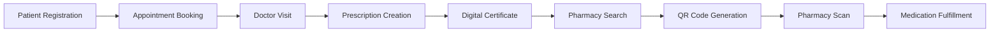

# PIYA Backend API

**A Full Digital Healthcare Coordination Platform** - Connecting Patients,
 Doctors, Hospitals, and Pharmacies

Built with ASP.NET Core 9.0 and PostgreSQL | Healthcare Ecosystem |
HIPAA-Compliant Ready

## Progress: 

---

## Project Vision

PIYA is evolving from a **Pharmacy Location API** into a **comprehensive
  healthcare coordination platform** that digitizes the entire patient journey:

```text
Patient → Doctor Appointment → Prescription → Pharmacy Fulfillment → Digital Verification
```

### Core Capabilities

- **Real-time appointment booking** with conflict prevention
- **Digital prescription management** with pharmacy inventory matching
- **Hospital & doctor coordination** with availability synchronization
- **QR-based secure medication pickup** with time-limited validation
- **Digital medical certificates** for schools and workplaces
- **Smart pharmacy search** based on medication availability
- **Enterprise-grade security** with audit logging and role-based access

---

## System Architecture

### Healthcare Flow



### Security Model

- **Multi-role system:** Patient, Doctor, Pharmacist, SchoolAdmin, SystemAdmin
- **JWT + Refresh Token** authentication (15-30 min access, 7-day refresh)
- **BCrypt password hashing** (work factor 11)
- **Time-limited QR tokens** (5-minute validity)
- **Audit logging** for all healthcare transactions
- **GDPR-compliant** data handling

---

## Features to Implement

### Authentication & Security

- [x] **Fix JWT Token Generation**
- [x] **Implement Password Hashing**
- [x] **Add JWT Authentication Middleware**
- [x] **Implement Token Validation**
- [x] **Fix Token Expiration Access**
- [x] **Add Refresh Token Logic**
- [x] **Role-Based Authorization (Patient/Doctor/Pharmacist/Admin)**
- [x] **Multi-Factor Authentication**
- [x] **Audit Logging System**
- [x] **QR Token Generation & Validation**

### Appointment System (NEW)

- [ ] **Appointment Booking API**
- [ ] **Doctor Availability Management**
- [ ] **Real-time Conflict Detection**
- [ ] **Appointment Status Tracking (Scheduled/Completed/Cancelled/NoShow)**
- [ ] **Calendar Integration**
- [ ] **Booking Confirmation Notifications**
- [ ] **Appointment History**
- [ ] **Multi-hospital Support**

### Prescription Management (NEW)

- [ ] **Digital Prescription Creation**
- [ ] **Prescription-Patient-Doctor Linking**
- [ ] **Prescription Status Management (Active/Used/Expired/Cancelled)**
- [ ] **Multi-medication Support**
- [ ] **Dosage & Instructions Tracking**
- [ ] **Prescription Expiration Logic**
- [ ] **Prescription Verification Endpoint**
- [ ] **Prescription History**

### Hospital & Doctor Management (NEW)

- [ ] **Hospital Entity & CRUD**
- [ ] **Doctor Profile Management**
- [ ] **Doctor Specialization Tracking**
- [ ] **Working Hours Configuration**
- [ ] **Doctor-Hospital Association**
- [ ] **Doctor Availability Sync (Online/Offline)**
- [ ] **Doctor Dashboard**

### Medication Database (NEW - CRITICAL)

- [ ] **Medication Entity Model**
- [ ] **Azerbaijan Pharmaceutical Registry Integration**
- [ ] **Medication Search & Autocomplete**
- [ ] **Active Ingredient Tracking**
- [ ] **ATC Code Classification**
- [ ] **Prescription-Required Flag**
- [ ] **Medication Alternatives/Generics**
- [ ] **Medication Master Data Management**

### Pharmacy Inventory System (NEW)

- [ ] **PharmacyInventory Model**
- [ ] **Real-time Stock Tracking**
- [ ] **Low Stock Alerts**
- [ ] **Inventory Update API**
- [ ] **Stock History**
- [ ] **Expiration Date Tracking**
- [ ] **Batch Number Management**

### Smart Pharmacy Search (ENHANCED)

- [x] **SearchService.SearchByCountry()**
- [x] **SearchService.SearchByCity()**
- [x] **SearchService.SearchByRadius()**
- [ ] **Search by Medication Availability (Multi-med Match)**
- [ ] **Filter Pharmacies with Full Prescription Stock**
- [ ] **Sort by Distance + Stock Availability**
- [ ] **Real-time Inventory Integration**

### QR Code System (NEW - HIGH SECURITY)

- [ ] **Generate Time-Limited QR Tokens (5-min validity)**
- [ ] **HMAC-Signed QR Payload**
- [ ] **QR Validation Endpoint**
- [ ] **Prescription Retrieval via QR**
- [ ] **QR Expiration & Revocation**
- [ ] **Pharmacist Scan Interface**
- [ ] **Anti-Replay Attack Prevention**
- [ ] **QR Audit Trail**

### Digital Medical Certificates (NEW)

- [ ] **DoctorNote Model (Patient/Doctor/Appointment)**
- [ ] **Public Verification Token Generation (32+ bytes, hashed)**
- [ ] **QR Code for Public Verification**
- [ ] **Note Status Management (Active/Revoked/Expired)**
- [ ] **POST /api/doctor-notes (Doctor only)**
- [ ] **GET /api/doctor-notes/{id} (Doctor/Patient)**
- [ ] **POST /api/doctor-notes/{id}/revoke (Doctor only)**
- [ ] **GET /api/doctor-notes/verify/{token} (Anonymous)**
- [ ] **DoctorNotePublicDto (Minimal exposure)**
- [ ] **ValidFrom/ValidTo Period Enforcement**
- [ ] **Privacy-Controlled Visibility (Summary optional)**
- [ ] **Tamper-Proof Token (HMAC or Hash-based)**
- [ ] **Certificate PDF Export (Optional)**

**Design Principles:**

- **No External Integration:** No school/workplace dashboards - public
  verification only
- **QR-Based Sharing:** Patient shares QR code, anyone can verify without account
- **Minimal Public Data:** Only essential info exposed (patient name
  optional/initials, doctor name, dates)
- **Tamper-Proof:** 32+ byte random token, hashed in DB, validated on verify
- **Revocable & Time-Limited:** Doctor can revoke, automatic expiration via ValidTo
- **Privacy First:** Diagnosis details private by default, VisibilityLevel flag
  for controlled exposure

**Public Verification Response (DoctorNotePublicDto):**

- Patient full name or initials (privacy-controlled)
- Doctor full name + license ID
- Clinic/hospital name (optional)
- Note reason category (e.g., "Medical Excuse") or "medical excuse" only
- ValidFrom / ValidTo dates
- IssuedAt timestamp
- Unique note number
- Status indicator (Active/Revoked/Expired)

### Configuration

- [x] **Create appsettings.json Template**
- [x] **Add Connection String Documentation**
- [x] **Environment-Specific Settings**
- [ ] **External API Configuration (Medication DB)**
- [ ] **QR Token Signing Key Management**

---

### High Priority

### User Management

- [x] **UserService.Authenticate()**
- [x] **UserService.Create()**
- [x] **UserService.GetById()**
- [x] **UserService.Update()**
- [x] **UserService.Delete()**
- [x] **Create UserController**
- [x] **Create AuthController**
- [ ] **User Role Assignment (Patient/Doctor/Pharmacist)**
- [ ] **Doctor Profile Extended Fields**
- [ ] **Pharmacist License Verification**

### Geolocation Services

- [x] **CoordinatesService.GetCountry()**
- [x] **CoordinatesService.GetCity()**
- [x] **CoordinatesService.CalculateDistance()**
- [x] **CoordinatesService CRUD Operations**

### Pharmacy Company Management

- [ ] **PharmacyCompanyService.GetById()**
- [ ] **PharmacyCompanyService.Create()**
- [ ] **PharmacyCompanyService.Update()**
- [ ] **PharmacyCompanyService.Delete()**
- [ ] **PharmacyCompanyService.GetAll()**
- [ ] **PharmacyCompaniesController Endpoints**

---

### Medium Priority

### API Improvements

- [ ] **Add Model Validation**
- [ ] **Global Exception Handling**
- [ ] **Add Logging (Audit + System)**
- [ ] **API Versioning**
- [ ] **Response DTOs**
- [ ] **Pagination**
- [ ] **Filtering & Sorting**
- [ ] **Request Rate Limiting**
- [ ] **API Documentation (Swagger Enhancements)**

### Authorization & Roles

- [x] **Role-Based Authorization (RBAC)**
- [x] **User Role Assignment**
- [x] **Policy-Based Authorization**
- [ ] **Pharmacy Manager Assignment**
- [ ] **Staff Management**
- [ ] **Doctor Permissions**
- [ ] **Admin Dashboard Access Control**

### Data Enhancements

- [ ] **Pharmacy Operating Hours**
- [ ] **Pharmacy Contact Info**
- [ ] **Pharmacy Services**
- [ ] **Pharmacy Ratings**
- [ ] **Search History**
- [ ] **Appointment Reminders**
- [ ] **Prescription Refill Reminders**

---

### Low Priority

### Advanced Features

- [ ] **Email Verification**
- [ ] **Password Reset Flow**
- [x] **Two-Factor Authentication**
- [ ] **File Upload (Medical Documents)**
- [ ] **Caching (Redis)**
- [ ] **Rate Limiting**
- [ ] **CORS Configuration**
- [ ] **Health Check Endpoints**
- [ ] **Real-time Notifications (SignalR)**
- [ ] **Push Notifications (FCM)**

### Integration & External Services

- [ ] **Google Maps API Integration**
- [ ] **Email Service (SendGrid/SMTP)**
- [ ] **SMS Service (Twilio)**
- [ ] **Export to PDF (Prescriptions/Certificates)**
- [ ] **Webhook Support**
- [ ] **Azerbaijan Pharmaceutical Database Integration**
- [ ] **Hospital Management System (HMS) Integration**
- [ ] **Electronic Health Record (EHR) Integration**

### Testing & Documentation

- [ ] **Unit Tests**
- [ ] **Integration Tests**
- [ ] **Swagger Annotations**
- [ ] **XML Documentation**
- [ ] **Postman Collection**
- [ ] **Architecture Documentation**
- [ ] **API Security Testing**
- [ ] **Load Testing**

---

## Database Schema (Expanded)

### Current Entities

- [x] **User** - Patients, Doctors, Pharmacists, Admins
- [x] **Token** - JWT + Refresh tokens
- [x] **Pharmacy** - Physical locations
- [x] **PharmacyCompany** - Pharmacy chains
- [x] **Coordinates** - Geolocation data

### New Healthcare Entities (To Be Implemented)

- [ ] **Hospital** - Medical facilities with departments
- [ ] **Appointment** - Patient-Doctor bookings with conflict prevention
- [ ] **Prescription** - Digital prescriptions with lifecycle management
- [ ] **PrescriptionItem** - Individual medications in prescription
- [ ] **Medication** - Master medication database (Azerbaijan registry)
- [ ] **PharmacyInventory** - Real-time stock tracking per pharmacy
- [ ] **DoctorNote** - Medical certificates with public QR verification (no
  external integration)
- [x] **AuditLog** - Comprehensive audit trail for healthcare transactions
- [x] **TwoFactorAuth** - Multi-factor authentication configuration

---

## Critical Implementation Challenges

### 1. Doctor Availability Conflicts

**Problem:** Double booking prevention across online/offline systems  
**Solution:**

- Row-level database locking
- Unique index on `(DoctorId + DateTime)`
- Transaction-based booking with conflict detection
- Real-time availability synchronization

### 2. Prescription Security & Fraud Prevention

**Problem:** Fake/duplicate prescriptions, prescription reuse  
**Solution:**

- Immutable prescription records (no edits after creation)
- Digital signature with HMAC
- One-time QR code validation
- Status tracking (Active → Used)
- Audit logging for all prescription actions

### 3. Medication Database Complexity

**Problem:** Thousands of medications, international variations  
**MVP Solution:**

- Start with Azerbaijan pharmaceutical registry only
- Focus on region-specific medications
- Manual data entry for initial dataset
- Future: API integration with WHO/openFDA

### 4. QR Code Security

**Problem:** QR code interception, replay attacks  
**Solution:**

- 5-minute token expiration
- HMAC-SHA256 signed payload
- One-time use enforcement
- No sensitive data in QR (token only)
- Server-side validation required

### 5. Healthcare Data Compliance

**Problem:** GDPR, HIPAA, medical data regulations  
**Requirements:**

- Encryption at rest and in transit
- Comprehensive audit logging
- Data retention policies
- Patient consent management
- Right to be forgotten implementation

---

## Architecture Components

### Models (Expanded Healthcare Domain)

**Authentication & Core:**

- [x] User (Multi-role: Patient/Doctor/Pharmacist/Admin)
- [x] Token (JWT + Refresh)

**Healthcare Operations:**

- [ ] Hospital
- [ ] Appointment
- [ ] Prescription
- [ ] PrescriptionItem
- [ ] Medication
- [ ] DoctorNote

**Pharmacy Operations:**

- [x] Pharmacy
- [x] PharmacyCompany
- [ ] PharmacyInventory

**Geolocation:**

- [x] Coordinates

**System:**

- [x] AuditLog

### Services (Interfaces + Implementations)

**Current:**

- [x] JwtService (JWT + Refresh token generation)
- [x] UserService (Authentication & user management)
- [x] SearchService (Pharmacy search with geolocation)
- [x] CoordinatesService (Haversine distance calculation)
- [x] PasswordHasher (BCrypt hashing)

**To Be Implemented:**

- [x] **AppointmentService** ✅ (Booking + conflict detection)
- [x] **PrescriptionService** ✅ (Digital prescription CRUD)
- [x] **MedicationService** ✅ (Medication database management)
- [x] **InventoryService** ✅ (Pharmacy stock tracking)
- [x] **QRService** ✅ (Time-limited QR generation/validation)
- [x] **DoctorNoteService** ✅ (Medical certificate with public QR verification)
- [x] **NotificationService** ✅ (Email/SMS/Push)
- [ ] PharmacyCompanyService (Currently empty)

**Implemented:**

- [x] AuditService (Healthcare transaction logging)
- [x] TwoFactorAuthService (2FA management with TOTP/SMS/Email)

### Controllers

**Current:**

- [x] AuthController (Register/Login/Refresh/Validate)
- [x] UserController (User CRUD + password change)
- [x] PharmacyController (Partial - search endpoints)
- [x] AuditController (Audit log retrieval - 5 endpoints)
- [x] TwoFactorAuthController (2FA management - 8 endpoints)

**To Be Implemented:**

- [ ] AppointmentController
- [ ] PrescriptionController
- [ ] MedicationController
- [ ] HospitalController
- [ ] DoctorController
- [ ] PharmacyInventoryController
- [ ] QRValidationController
- [ ] DoctorNoteController (Issue/Revoke/Verify endpoints)
- [ ] PharmacyCompaniesController

### Database

- [x] PostgreSQL with EF Core
- [x] Initial migration created
- [x] DbContext configured
- [x] RBAC, 2FA, and Audit logging migrations created
- [ ] Healthcare entities migrations (pending)

---

## Security Architecture

### Authentication Flow

```text
User Login → JWT Generation (15-30 min) + Refresh Token (7 days)
    → Token stored in database with device info
    → Protected endpoints validate JWT signature
    → Expired access token → Use refresh token → New access token
```

### Role-Based Access Control (RBAC)

```text
Patient: Book appointments, view prescriptions, search pharmacies
Doctor: Create prescriptions, manage appointments, issue notes
Pharmacist: Scan QR, fulfill prescriptions, update inventory
SchoolAdmin: Verify medical notes
SystemAdmin: Full system access, audit logs
```

### QR Code Security Flow

```text
Patient requests QR → Server generates HMAC-signed token (5-min expiry)
    → QR contains: { tokenId, signature, expiresAt }
    → Pharmacist scans → Server validates signature + expiry
    → If valid → Fetch prescription → Mark as "Used"
    → QR becomes invalid (one-time use)
```

---

## Tech Stack

| Component | Technology | Purpose |
| --------- | ---------- | ------- |
| **Framework** | ASP.NET Core 9.0 | Backend API |
| **Language** | C# 13 | Primary language |
| **Database** | PostgreSQL 16+ | Primary data store |
| **ORM** | Entity Framework Core 9.0 | Database access |
| **Authentication** | JWT (HS256) | Stateless auth |
| **Password Hashing** | BCrypt (Work Factor 11) | Secure password storage |
| **API Documentation** | Swagger/OpenAPI | API exploration |
| **Geolocation** | Haversine Formula | Distance calculations |
| **QR Generation** | QRCoder (planned) | QR code creation |
| **Notifications** | (TBD) | Email/SMS/Push |
| **Caching** | (TBD - Redis planned) | Performance optimization |
| **Logging** | (TBD - Serilog planned) | Audit + system logs |

---

## Development Roadmap

### Phase 1: Foundation (Current - 31% Complete)

- [x] Authentication & JWT
- [x] User management
- [x] Pharmacy search & geolocation
- [x] Password security
- [x] Role-based authorization (RBAC)
- [x] Two-factor authentication (2FA)
- [x] Audit logging system

### Phase 2: Healthcare Core (Next)

- [x] Multi-role authorization
- [ ] Appointment system
- [ ] Prescription management
- [ ] Hospital & doctor entities

### Phase 3: Pharmacy Integration

- [ ] Medication database (Azerbaijan)
- [ ] Pharmacy inventory system
- [ ] Stock-based pharmacy search
- [ ] QR code system

### Phase 4: Digital Certificates

- [ ] Medical notes/certificates (DoctorNote entity)
- [ ] Public QR verification (anonymous access)
- [ ] Token-based tamper-proof system
- [ ] Status management (Active/Revoked/Expired)
- [ ] Privacy-controlled visibility

### Phase 5: Production Readiness

- [x] Comprehensive audit logging
- [ ] GDPR compliance features
- [ ] Performance optimization
- [ ] Security hardening
- [ ] Integration testing
- [ ] Load testing

---

## Legal & Compliance Considerations

**This is regulated healthcare software. Requirements include:**

- **Data Protection:** GDPR compliance, encryption at rest/transit
- **Audit Trails:** Immutable logs for all healthcare transactions
- **Medical Standards:** Compliance with local healthcare regulations
- **Access Control:** Strict role-based permissions
- **Data Retention:** Configurable retention policies
- **Right to Deletion:** Patient data removal capabilities
- **Transparency:** Audit log access for authorized personnel

**WARNING: This system requires legal review and healthcare regulatory approval
  before production deployment.**

---

## Success Metrics

- **Appointment System:** Zero double-booking conflicts
- **Prescription Security:** 100% audit trail coverage
- **QR Validation:** < 2 second validation response time
- **Search Accuracy:** 95%+ medication availability match rate
- **System Uptime:** 99.9% availability target
- **Security:** Zero prescription fraud incidents

---

## Support & Contribution

**Repository:** [PIYA-Tech/PIYA-Server](https://github.com/PIYA-Tech/PIYA-Server)
**Current Branch:** master
**Build Status:** [x] Passing

For healthcare compliance questions, security concerns, or architectural
  decisions, please open an issue with appropriate tags.

---

**Building the future of digital healthcare in Azerbaijan.**
